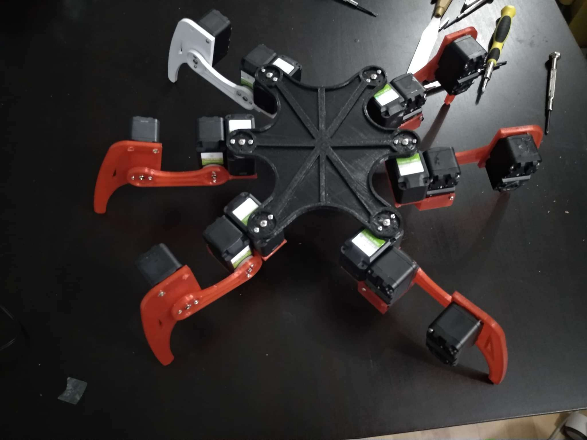

# hexapod

This is a hexapod robot project, designed to be built with 18 HerkuleX DRS-0101 servos. The frame of the hexapod robot was initially intended to be build with acrylic (plexiglass) sheets and hand-cut, but after some attempts at cutting the acrylic, it was decided it would be more efficient and accurate to 3D print the frame instead.

The constructed hexapod with the servos and 3D printed parts:

## Simulation of kinematics

With help from a [hexapod robot simulator](https://github.com/mithi/hexapod) the inverse kinematics of the robot and its corresponding servo movements were solved by scripting a gait simulator with a skeleton hexapod model made in Blender using Python.

Simulating kinematics with a Python script to animate skeleton hexapod model in Blender:

## Creation of the hexapod frame

The hexapod frame was modelled with mainly the measurements and the dimensions, as well as movement range of the HerkuleX DRS-0101 servos in mind. Before switching over to 3D printed this model was used to create the acrylic blueprints to cut out the hexapod frame. The frame was modelled to size using Blender in `model/blender/my_hexapod_frame.blend` and exported to .stl and then used Cura to generate its .gcode to print with a 3D printer using Pronterface. 

Through several printing trials the scale of some of the parts of the frame were slightly adjusted and the .stl and .gcode of iterations of these trials are in the repository in `model/blender/stl/` and `model/blender/gcode/` respectively.

3D model of hexapod in Blender, with parts positioned as they would be constructed:

Wireframe of 3D model:

Overview of parts on acrylic blueprint from `model/acrylic_blueprints/`:

## Interfacing with the servos

To interface with and move the servos an Arduino microcontroller was used; with an ESP32 microcontroller the servos on the hexapod could also be controlled using Wi-Fi/Bluetooth. To test for driver issues on the motor this project also wrote some test scripts in Python.

